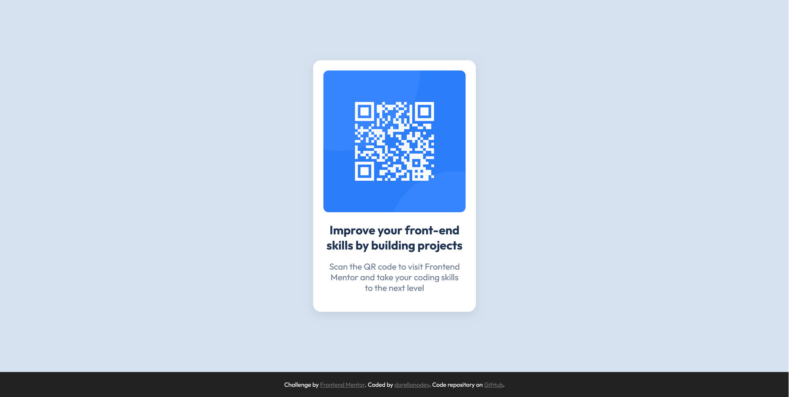

# Frontend Mentor - QR code component solution

This is a solution to the [QR code component challenge on Frontend Mentor](https://www.frontendmentor.io/challenges/qr-code-component-iux_sIO_H). Frontend Mentor challenges help you improve your coding skills by building realistic projects.

## Table of contents

- [Frontend Mentor - QR code component solution](#frontend-mentor---qr-code-component-solution)
  - [Table of contents](#table-of-contents)
  - [Overview](#overview)
    - [Screenshot](#screenshot)
    - [Links](#links)
  - [My process](#my-process)
    - [Built with](#built-with)
    - [What I learned](#what-i-learned)
    - [Continued development](#continued-development)
    - [Useful resources](#useful-resources)
  - [Author](#author)

## Overview

### Screenshot



### Links

- Solution URL: [GitHub repository](https://github.com/darellanodev/fm-projects/01-qr-code-component)
- Live Site URL: [Live site](https://darellanodev.github.io/fm-projects/01-qr-code-component)

## My process

### Built with

- **Semantic HTML5 markup**  
  (Using semantic tags like `<main>`, `<article>`, `<footer>`)
- **CSS custom properties (variables)**  
  (Centralized color palette, sizes, border radii, and fonts in `:root`)
- **Flexbox**  
  (For layout structure and vertical/horizontal centering)
- **Responsive design with media queries**  
  (Font sizes and layout adapt to small screens)
- **BEM-inspired class naming**  
  (Classes like `.card__image`, `.card__content` for clarity and maintainability)
- **Accessibility best practices**  
  (Descriptive `alt` attributes for images and secure links with `rel="noopener"`)
- **Google Fonts**  
  (Loading and using the "Outfit" font from Google Fonts)

### What I learned

While working on this project, I deepened my understanding of several key web development concepts:

- **Semantic HTML**  
  I used semantic tags like `<main>`, `<article>`, and `<footer>` to create a meaningful and accessible document structure.

- **CSS Custom Properties (Variables)**
  I centralized colors, font sizes, and border radii using CSS variables, which improved maintainability and scalability.

```css
:root {
  --clr-bg: hsl(212, 45%, 89%);
  --radius-card: 0.9rem;
  --font-title: 1.4rem;
}
```

- **Responsive Design with Flexbox and Media Queries**
  I combined Flexbox for layout and media queries to ensure the design adapts smoothly to different screen sizes.

```css
.card {
  display: flex;
  flex-direction: column;
  align-items: center;
  width: 19rem;
}

@media (max-width: 350px) {
  .card {
    width: 90vw;
    padding: 1rem;
  }
}
```

- **BEM-inspired Class Naming**
  I applied BEM-like naming conventions for clarity and modularity in CSS class names.

```html
<div class="card__content">
  <h1>Title</h1>
  <p>Description</p>
</div>
```

- **Accessibility Best Practices**
  I ensured images have descriptive `alt` attributes and external links use `rel="noopener"` for security.

```html

<a href="https://frontendmentor.io" target="_blank" rel="noopener">Frontend Mentor</a>
```

### Continued development

In future projects, I would like to focus on the following areas to further improve my frontend skills:

- **Adopting a Mobile-First Workflow**  
  While my project is responsive, I want to get more comfortable with designing and coding mobile-first, building styles for small screens first and then enhancing for larger devices using `min-width` media queries.

- **Deeper Accessibility Practices**  
  I plan to learn more about accessibility, including ARIA roles, keyboard navigation, and color contrast to ensure my projects are usable by everyone.

- **Exploring CSS Grid**  
  I primarily used Flexbox for layout in this project. I want to experiment more with CSS Grid for more complex and flexible layouts.

- **Performance Optimization**  
  I aim to improve my understanding of web performance, such as optimizing images, reducing CSS file size, and improving load times.

- **Component Reusability and Scalability**  
  I want to practice structuring my CSS and HTML so that components are even more reusable and scalable, possibly exploring methodologies like ITCSS or utility-first CSS.

By focusing on these areas, I hope to write cleaner, more efficient, and more accessible code in future projects.

### Useful resources

- [Perplexity AI](https://www.perplexity.ai/) - This AI tool helped me review my code as I was building the project. I used it to get suggestions on best practices, accessibility, and code organization. I found its feedback and explanations very helpful and will use it in future projects.

## Author

- Website - [darellanodev](https://darellanodev.github.io/)
- Frontend Mentor - [@darellanodev](https://www.frontendmentor.io/profile/darellanodev)
