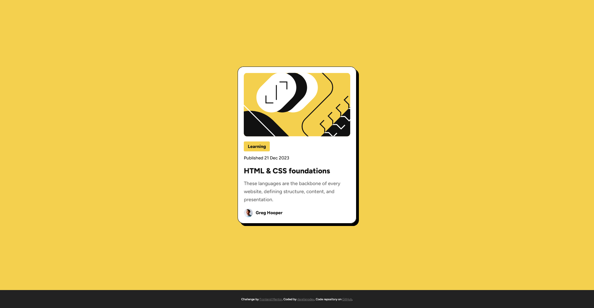

# Frontend Mentor - Blog preview card solution

This is a solution to the [Blog preview card challenge on Frontend Mentor](https://www.frontendmentor.io/challenges/blog-preview-card-ckPaj01IcS). Frontend Mentor challenges help you improve your coding skills by building realistic projects.

## Table of contents

- [Frontend Mentor - Blog preview card solution](#frontend-mentor---blog-preview-card-solution)
  - [Table of contents](#table-of-contents)
  - [Overview](#overview)
    - [The challenge](#the-challenge)
    - [Screenshot](#screenshot)
    - [Links](#links)
  - [My process](#my-process)
    - [Built with](#built-with)
    - [What I learned](#what-i-learned)
    - [Continued development](#continued-development)
    - [Useful resources](#useful-resources)
  - [Author](#author)

## Overview

### The challenge

Users should be able to:

- See hover and focus states for all interactive elements on the page

### Screenshot



### Links

- Solution URL: [GitHub repository](https://github.com/darellanodev/fm-projects/tree/main/02-blog-preview-card)
- Live Site URL: [Live site](https://darellanodev.github.io/fm-projects/02-blog-preview-card)

## My process

### Built with

- **Semantic HTML5 markup**  
  (Using semantic tags like `<main>`, `<article>`, `<footer>`)
- **CSS custom properties (variables)**  
  (Centralized color palette, sizes, border radii, and fonts in `:root`)
- **Flexbox**  
  (For layout structure and vertical/horizontal centering)
- **BEM-inspired class naming**  
  (Classes like `.card__image`, `.card__content` for clarity and maintainability)
- **Accessibility best practices**  
  (Descriptive `alt` attributes for images and secure links with `rel="noopener"`)
- **Google Fonts**  
  (Loading and using the "Figtree" font from Google Fonts)

### What I learned

I learned that grouping CSS variables by their functionality is a good way to organize them. For example:

```css
:root {
  font-size: 14px;
  --font-family-base: 'Figtree', sans-serif;
  --font-weight-regular: 500;
  --font-weight-bold: 800;

  --background-page: #f4d04e;
  --background-footer: #222;
  --color-footer-text: #fff;
  --color-footer-links: #777;
  --background-card: #fff;
  --color-gray-950: #111;
  --color-gray-500: #6b6b6b;

  --radius-card: 1.2rem;
  --radius-image: 0.7rem;
  --radius-tag: 0.2rem;
  --border-width-card: 1px;

  --padding-card: 1.2rem;
  --padding-tag: 0.2rem 0.8rem;

  --shadow-card: 8px 8px 0px 0px black;

  --size-text-title: 1.5rem;
  --size-text-card: 0.9rem;
  --size-text-date: 0.9rem;
  --size-text-footer: 0.6rem;

  --gap-card-content: 1rem;
  --gap-author: 0.6rem;

  --max-width-card: 24rem;
}
```

### Continued development

I'd like to focus on mobile-first development and continue learning about best practices.

### Useful resources

- [Perplexity AI](https://www.perplexity.ai/) - This AI tool helped me review my code as I was building the project. I used it to get suggestions on best practices, accessibility, and code organization. I found its feedback and explanations very helpful and will use it in future projects.

## Author

- Website - [darellanodev](https://darellanodev.github.io/)
- Frontend Mentor - [@darellanodev](https://www.frontendmentor.io/profile/darellanodev)
