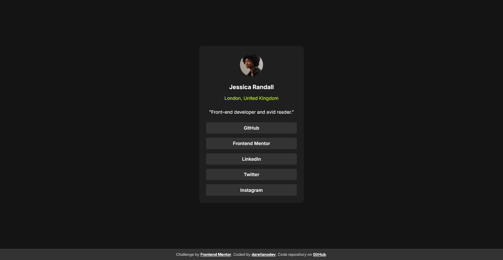

# Frontend Mentor - Social links profile solution

This is a solution to the [Social links profile challenge on Frontend Mentor](https://www.frontendmentor.io/challenges/social-links-profile-UG32l9m6dQ). Frontend Mentor challenges help you improve your coding skills by building realistic projects.

## Table of contents

- [Frontend Mentor - Social links profile solution](#frontend-mentor---social-links-profile-solution)
  - [Table of contents](#table-of-contents)
  - [Overview](#overview)
    - [The challenge](#the-challenge)
    - [Screenshot](#screenshot)
    - [Links](#links)
  - [My process](#my-process)
    - [Built with](#built-with)
    - [What I learned](#what-i-learned)
    - [Continued development](#continued-development)
    - [Useful resources](#useful-resources)
  - [Author](#author)

## Overview

### The challenge

Users should be able to:

- See hover and focus states for all interactive elements on the page

### Screenshot



### Links

- Solution URL: [Add solution URL here](https://your-solution-url.com)
- Live Site URL: [Add live site URL here](https://your-live-site-url.com)

## My process

### Built with

- **Semantic HTML5 markup**  
  (Using semantic tags like `<main>`, `<article>`, `<footer>`)
- **CSS custom properties (variables)**  
  (Centralized color palette, sizes, border radii, and fonts in `:root`)
- **Flexbox**  
  (For layout structure and vertical/horizontal centering)
- **BEM-inspired class naming**  
  (Classes like `.card__image`, `.card__content` for clarity and maintainability)
- **Accessibility best practices**  
  (Descriptive `alt` attributes for images and secure links with `rel="noopener"`)
- **Google Fonts**  
  (Loading and using the "Inter" font from Google Fonts)

### What I learned

I learned about using the `clamp` function in CSS for smooth transitions between small and large screen devices.

```css
:root {
  font-size: clamp(0.6rem, 2vw + 0.5rem, 1rem);
  /* other styles */
}
```

I also learned that grouping CSS variables by their functionality is a good way to organize them. For example:

```css
:root {
  font-size: clamp(0.6rem, 2vw + 0.5rem, 1rem);
  --font-family-base: 'Figtree', sans-serif;
  --font-weight-regular: 500;
  --font-weight-bold: 800;

  --background-page: #f4d04e;
  --background-footer: #222;
  --color-footer-text: #fff;
  --color-footer-links: #777;
  --background-card: #fff;
  --color-gray-950: #111;
  --color-gray-500: #6b6b6b;

  /* other styles */
}
```

I also learned about CSS logical properties

```css
.blog-card__date {
  margin-block-start: -0.5rem;
  /* other styles */
}
```

Finally, I also learned that if you follow a mobile-first approach, you must use `min-width` instead of `max-width` for media queries, and then when the viewport increases, the styles can be overridden. However, in this exercise, because I only want to change the text sizes, it is not necessary to use media queries.

### Continued development

I'd like to focus on mobile-first development and continue learning about best practices.

### Useful resources

I used the [Perplexity AI](https://www.perplexity.ai/) tool and the [Windsurf](https://marketplace.visualstudio.com/items?itemName=Waka.windsurf) VSCode extension to help me review my code as I was building the project. I also used them to get suggestions on best practices, accessibility, and code organization. As a Spanish speaker, I sometimes use these tools to correct or improve my English sentences. I found their feedback and explanations very helpful, and I will use them in future projects.

## Author

- Website - [darellanodev](https://darellanodev.github.io/)
- Frontend Mentor - [@darellanodev](https://www.frontendmentor.io/profile/darellanodev)
