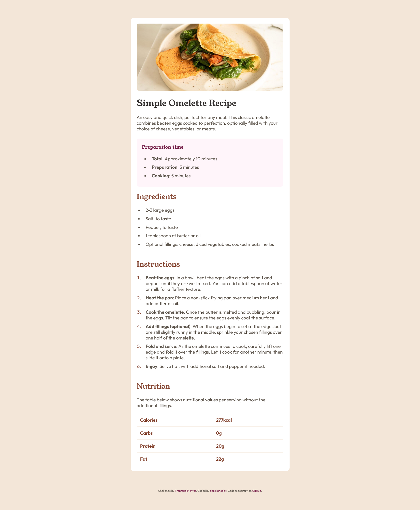

# Frontend Mentor - Recipe page solution

This is a solution to the [Recipe page challenge on Frontend Mentor](https://www.frontendmentor.io/challenges/recipe-page-KiTsR8QQKm). Frontend Mentor challenges help you improve your coding skills by building realistic projects.

## Table of contents

- [Frontend Mentor - Recipe page solution](#frontend-mentor---recipe-page-solution)
  - [Table of contents](#table-of-contents)
  - [Overview](#overview)
    - [Screenshot](#screenshot)
    - [Links](#links)
  - [My process](#my-process)
    - [Built with](#built-with)
    - [What I learned](#what-i-learned)
    - [Continued development](#continued-development)
    - [Useful resources](#useful-resources)
  - [Author](#author)

## Overview

### Screenshot

### Links

- Solution URL: [Add solution URL here](https://github.com/darellanodev/fm-projects/tree/main/04-recipe-page)
- Live Site URL: [Add live site URL here](https://darellanodev.github.io/fm-projects/04-recipe-page/dist/index.html)

## My process

### Built with

Fonts, Font sizes, Colors, Spacing, Border radius, Component sizing, Weights, Misc

- **Semantic HTML5 markup**  
  (Using semantic tags like `<main>`, `<article>`, `<section>`, `<footer>`)
- **CSS custom properties (variables)**  
  (Centralized fonts, sizes, spacing, border radii in `:root`)
- **Flexbox**  
  (For layout structure and vertical/horizontal centering)
- **BEM-inspired class naming**  
  (Classes like `.recipe-card__description`, `recipe-card__instruction-list` for clarity and maintainability)
- **Accessibility best practices**  
  (Descriptive `alt` attributes for images and secure links with `rel="noopener"`)
- **Google Fonts**  
  (Loading and using the "Outfit" and "Young Serif" fonts from Google Fonts)
- **Vue components**
  (Breaking down the UI into smaller, reusable components for improved readability and maintainability)

### What I learned

I learned how to use Vue to break down the UI into smaller, reusable components for improved readability and maintainability. I also learned how to install Vue with Vite.

### Continued development

I'd like to focus on continuing to use technologies that I can apply in the frontend, focusing on best practices. Additionally, I'd like to learn techniques for implementing dark mode, such as how to enable/disable it and how to detect if the browser is configured to use dark mode and present a more suitable theme.

### Useful resources

I used the [Perplexity AI](https://www.perplexity.ai/) tool and the [Windsurf](https://marketplace.visualstudio.com/items?itemName=Waka.windsurf) VSCode extension to help me review my code as I was building the project. I also used them to get suggestions on best practices, accessibility, and code organization. As a Spanish speaker, I sometimes use these tools to correct or improve my English sentences. I found their feedback and explanations very helpful, and I will use them in future projects.

## Author

- Website - [darellanodev](https://darellanodev.github.io/)
- Frontend Mentor - [@darellanodev](https://www.frontendmentor.io/profile/darellanodev)
